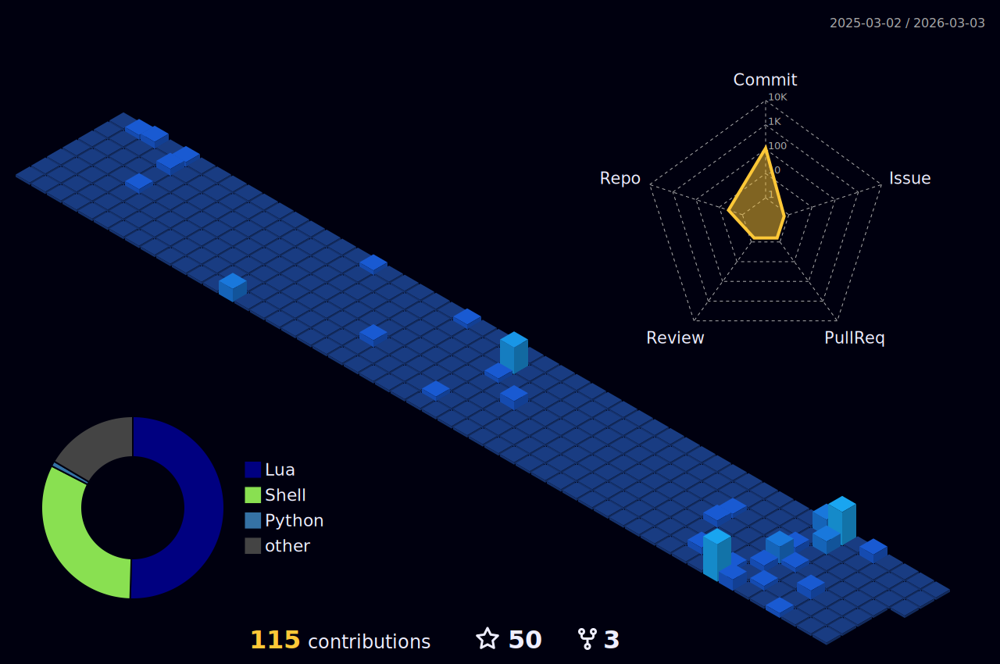

## 📊 Activity statistics

</td>
</tr>
<tr>
<td colspan="2">

## 💡 Check out my stats

Please keep in mind these are just my most used languages within my Repos on GitHub and do not indicate my skill in the language.

<table>
<tr>
<td width="50%">

</td>
<td width="50%">

</td>
</tr>
<tr>
<td width="50%">

</td>
<td width="50%">

</td>
</tr>
<tr>
<td colspan="2">

</td>
</tr>
</table>

3D visualization of my GitHub contributions.

## 👋 About Me
Hi there! I'm Quintin Lee, a developer passionate about Neovim customization, embedded systems, and open-source tools. I enjoy configuring development environments, working on STM32 projects, and contributing to the community.

## 🚀 Skills
- **Languages**: Python, C/C++, Lua
- **Frameworks**: Neovim plugins
- **Tools**: Git, VS Code, Docker, Neovim, Vim, Tmux, Zsh, Fzf, SSH
- **Databases**: MongoDB, MySQL, Informix
- **Other**: Embedded systems (STM32), Linux configuration

## 📂 Projects
Here are my latest updated projects:
- [NVCode](https://github.com/quintin-lee/NVCode): neovim 配置
- [quintin-lee](https://github.com/quintin-lee/quintin-lee): No description
- [dotfiles](https://github.com/quintin-lee/dotfiles): zsh、tmux、vim、git、fzf 等配置
- [header.nvim](https://github.com/quintin-lee/header.nvim): No description
- [ssh-manager](https://github.com/quintin-lee/ssh-manager): 基于 expect 工具实现 SSH 自动登录服务器，管理服务器 SSH 连接。 支持密码认证和密钥认证等多种方式，提供了交互式的终端界面。
- [penv](https://github.com/quintin-lee/penv): Python venv manager
- [openscad-treesitter.nvim](https://github.com/quintin-lee/openscad-treesitter.nvim): No description

## 🎯 Interests
- Neovim customization and plugins
- Embedded systems development
- Open-source tool development
- Linux environment configuration
- AI-assisted coding
- Gaming
- Traveling

## 📬 Contact Me

- **Email**: [2449164582@qq.com](mailto:2449164582@qq.com)
